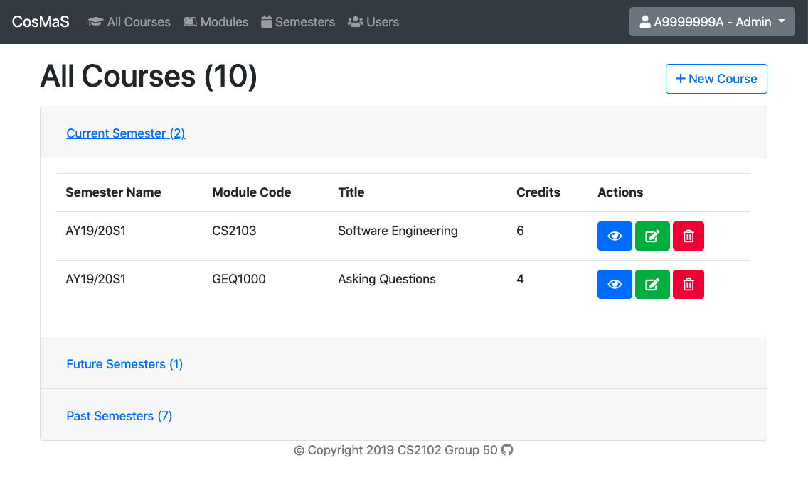

# CS2102 Project - Course Management System

[Full Project Report](docs/Project%20Report.pdf)

## 1.What is CosMas?

CosMaS is a course management system that allows professors to manage a course that he/she is teaching. Students may request to enter a course. Professors may categorize students in the course into groups such as the different tutorial groups. Professors may create forums where only certain groups or collection of groups in the course can read or write. However, the professor may read, write, or delete threads and replies in the forum.

Additionally, professors may add teaching assistants to manage groups. Teaching assistants cannot create groups or forums but can read, write, or delete entries in the forum.

Each user must have an account.

## 2.Features

### 2.1 User management

In CosMaS, generally there are two types of user, which are admin user and normal user. Admin user accounts can only be created through directly adding to the database. Admin users can access more pages such as the list of users, semesters, modules compared to normal users. A normal user account can be easily set up with a 9-character user ID (following the standard of NUS matriculation number) and a password. The raw password will be encrypted and only the encrypted password will then be safely saved into our database. After logging in, admin users will be redirected to the following page which consists of a list of all the courses which are grouped according to the semesters:



However, for normal users, they will be redirected to their dashboard which contains their own information such as the courses they have been enrolled, teaching or tutoring: 


### 2.2 Semesters, modules, and courses

Before the start of each semester, the admin has to set up the new semester and specify the start time and end time of the semester. The admin is also in charge of managing modules and courses and only the admin has the right to create, update, destroy these entities. The difference between module and course is that a module can be offered in each semester as a course. For example, there is only one module CS2102, but it can be offered in multiple semesters as independent courses. 

### 2.3 Course and group memberships

Each user in CosMaS can be enrolled in any number of existing courses. A user can apply for a course request as a student to enter a course that is offered in the current semester or will be offered in future semesters by clicking on the `request to join` button on the course page.


Admins or professors of that course will then be able to approve or reject these requests on the following page. Upon approval, the requester will be automatically added to the course as a student.


As for professors, only admin can assign a user as the professor of a course. The assigned professor can then assign other users as teaching assistants of his/her course. These teaching assistants can also be further categorized into different groups.

A list of all members involved in a course will be shown in the course membership page. All professors, teaching assistants and students will be displayed in this page. Admin is able to view a member’s dashboard which contains all the relevant course information of that member by clicking the `view` button. Admins can also delete any member from this course if necessary. Professor can only delete teaching assistants or students from this course i.e. they cannot delete themselves or other professors in the course.


Each course can have zero or more groups for students.  A list of existing groups within each course is shown on each individual course page. Admin or professor can add a new group to this course with a specified group name. They can also view, edit or delete the group. The following diagram shows the course page which consists of a list of groups within the course CS2102 AY18/19S1.


Group memberships are made up of teaching assistants and students from this course. A list of teaching assistants and students in each group will be shown in the individual group page. Teaching assistants are able to view all the groups in their courses, and students in a group are able to view all other members in the group. Admins or professors can add or remove teaching assistants to or from a particular group, and add students enrolled in this course into a particular group. They can also delete a student from the group.

Admins can view all the student’s and teaching assistants’ dashboard from a group, while a student can only view his or her own dashboard.


### 2.4 Forums, threads, and replies

Each course in CosMas can have zero or more forums. Forums are platforms for discussion and exchange among students. Forums can also serve as a platform for students to communicate with the course instructors (professors and teaching assistants).
A forum consists of multiple threads. Each thread is usually for a particular topic. For example, forum named “Tutorials” can have a thread named “Need help with q2 of tutorial 3”. Forum members can respond to a thread by posting replies. 


Only professors can create forums. The professor him/herself has full access to write, read, or delete threads and replies in the forum. Access to forums for other members of the course are granted on a group basis. Only groups granted access by the professor can read posts in a particular forum and create new entries in it. Any number of groups can be granted access to any number of forums.

The professors can also assign teaching assistants to help him/her manage the forum. Teaching assistants also have full read, write, and delete access to the threads and replies. 


### 2.5 Batch insertion/update

Another user-friendly feature of our application is that we support batch insert and update for adding users to a group or course. We understand that adding one user at a time can be time consuming especially when you have a large amount of users to process. Batch insert and update is powered through PostgreSQL functions. As for the front-end, we also makes use of BootStrap Select to support live search so that users do not need to scroll over a long list of users to locate the correct user to add.


# Developer Guide

## Pre-requisites

- npm (6.14.5)
- node (14.4.0)
- PostgreSQL (12.3)

## Getting started

1. You may wish to create a new psql database for this project. To do so, first enter the psql console by running `psql YOUR_PSQL_USERNAME`. For fresh installations of psql on macOS, try `psql postgres`.

```sql
CREATE DATABASE cosmas;
```

Replace `cosmas` with any name you like.

2. Create a file named `.env` under the project root directory and copy the content of `.env.template` to it.

```shell
DATABASE_URL=postgres://:@localhost:5432/postgres
SECRET=keyboard cat
```

The database URL is in the format of `postgresql://[user[:password]@][netloc][:port][/dbname]`. Replace anything as required. For example, if you created a database named `cosmas` in the previous step, the database URL might look like `postgres://:@localhost:5432/cosmas`.

3. At the **project root directory**, enter the psql console and then run `\i ./sql/setup.sql;` to create the tables, functions, triggers and seed data.

(Note: we assume that admin will create new semesters beforehand, so we need to manually add new semesters to seed if existing data is outdated.)

Note: existing database tables might be dropped.

4. Run `npm install` to install all the packages and dependencies.

5. Run `npm start`.

6. Open your browser and go to `localhost:3000`, you should see
   the login page. You can login with the accounts created in the seeds or sign up for a new account.

7. The seed data contains an admin account with User ID `A9999999A`, name `Admin` and password `admin`. For non-admin accounts,
   the passwords are `password` and you can refer to `sql/seeds.sql` for their user IDs and names.

## Contributing

- Remember to run `npm run check` and `npm run fix` (if the previous check fails) before you commit!

## Deployment

### Reseed DB

```shell
heroku pg:psql
\i ./sql/setup.sql;
```

### Deploy to Heroku

#### First time

```shell
heroku login
heroku git:remote -a cosmas-cs2102
```

#### Redeploy

```shell
git push heroku master
```
